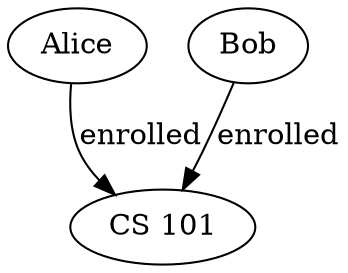
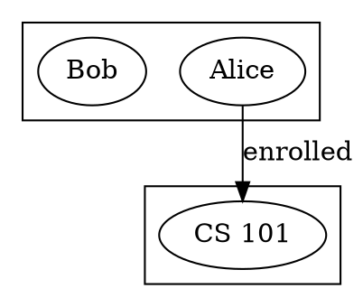

# DOT Data Instance

The `DotDataInstance` is a robust `IInputDataInstance` backed by DOT graph notation. It bridges DOT's simple graph format to Spytial's typed data model — with a clear story for types, hierarchies, and defaults.

## Core DOT Support

The implementation supports a focused core of DOT:

| Feature | Supported |
|---------|-----------|
| `digraph { ... }` | ✅ Directed graphs |
| `graph { ... }` | ✅ Undirected graphs |
| Node declarations | ✅ With attributes |
| Edge declarations | ✅ With labels → relation names |
| Node `label` attribute | ✅ Becomes atom label |
| Subgraphs | ✅ For type inference |

## Simplest Usage — No Config Needed

```typescript
import { DotDataInstance } from 'spytial-core';

const inst = new DotDataInstance('digraph { a -> b; b -> c; }');

inst.getAtoms();
// → [{ id: "a", type: "Node", label: "a" }, 
//    { id: "b", type: "Node", label: "b" },
//    { id: "c", type: "Node", label: "c" }]

inst.getRelations();
// → [{ id: "edge", name: "edge", types: ["Node", "Node"], tuples: [...] }]

inst.getTypes();
// → [{ id: "Node", types: ["Node"], atoms: [...], isBuiltin: false }]
```

**Every default is sensible.** DOT doesn't have to provide types, labels, or configuration — everything "just works" for basic visualization.

## Defaults (What DOT Doesn't Have to Provide)

| Feature | Default | Override via |
|---------|---------|--------------|
| Node type | `"Node"` | `type` attribute on node, or `typeConfig.defaultType` |
| Type hierarchy | Flat: `[typeName]` | `typeConfig.types` with `extends` |
| `isBuiltin` | `false` for all types | `typeConfig.types` or `typeConfig.builtinTypes` |
| Unlabeled edge relation | `"edge"` | `defaultRelationName` option |
| Node label | Node ID | `label` attribute on node |

## The Types Story

DOT has no native type system. `DotDataInstance` layers one on with three mechanisms:

### 1. Type Extraction — Where Does a Node's Type Come From?

**Attribute-based (default):** Add a `type` attribute to DOT nodes.



```typescript
const inst = new DotDataInstance(dot);
inst.getTypes().map(t => t.id); // → ["Person", "Course"]
```

**Subgraph-based:** Use DOT subgraphs to group nodes by type (strips `cluster_` prefix).



```typescript
const inst = new DotDataInstance(dot, { typeExtraction: 'subgraph' });
```

**Both:** Try attribute first, fall back to subgraph.

```typescript
const inst = new DotDataInstance(dot, { typeExtraction: 'attribute+subgraph' });
```

### 2. Type Hierarchy — The `extends` Chain

Declare type hierarchies via `DotTypeConfig`:

```typescript
import { DotDataInstance, DotTypeConfig } from 'spytial-core';

const typeConfig: DotTypeConfig = {
  types: {
    Entity: {},                          // Root type
    Person:  { extends: 'Entity' },      // Person → Entity
    Student: { extends: 'Person' },      // Student → Person → Entity
    Faculty: { extends: 'Person' },      // Faculty → Person → Entity
    Course:  { extends: 'Entity' },      // Course → Entity
  },
  defaultType: 'Entity',
};

const inst = new DotDataInstance(dot, { typeConfig });
```

The resulting `IType` objects carry the full hierarchy:

```typescript
inst.getTypes().find(t => t.id === 'Student');
// → { id: "Student", types: ["Student", "Person", "Entity"], atoms: [...], isBuiltin: false }
```

This hierarchy powers:
- **Projections** — `applyProjections()` filters type-aware
- **Schema generation** — `generateAlloySchema()` / `generateSQLSchema()` use `extends`
- **Ancestry checks** — `inst.typeIsOfType('Student', 'Entity')` → `true`

**If you don't provide a config**, every type gets a flat hierarchy `[typeName]`. This is fine for simple visualization.

### 3. Built-in Types — Opt-in

Mark types as built-in so they can be hidden in graph views or excluded from schema generation:

```typescript
const typeConfig: DotTypeConfig = {
  types: {
    Int:    { isBuiltin: true },
    String: { isBuiltin: true },
    Person: {},
  },
  // Or equivalently:
  builtinTypes: ['Int', 'String'],
};
```

Both methods are merged — use whichever is more convenient.

**By default, nothing is built-in.** You only need this when you have primitive/utility types you want to treat specially.

## Full Options Reference

```typescript
interface DotDataInstanceOptions {
  /** Type config: hierarchy, builtins, default type. */
  typeConfig?: DotTypeConfig;
  
  /** How to extract types: 'attribute' | 'subgraph' | 'attribute+subgraph' */
  typeExtraction?: string;  // default: 'attribute'
  
  /** Which node attribute holds the type. */
  typeAttribute?: string;   // default: 'type'
  
  /** Relation name for unlabeled edges. */
  defaultRelationName?: string;  // default: 'edge'
}

interface DotTypeConfig {
  /** Type hierarchy declarations. */
  types?: Record<string, DotTypeDescriptor>;
  
  /** Default type for untyped nodes. */
  defaultType?: string;  // default: 'Node'
  
  /** Additional built-in type names. */
  builtinTypes?: string[];
}

interface DotTypeDescriptor {
  extends?: string;      // Parent type ID
  isBuiltin?: boolean;   // default: false
}
```

## Mutations

`DotDataInstance` implements the full `IInputDataInstance` interface:

```typescript
const inst = new DotDataInstance('digraph {}');

// Add atoms
inst.addAtom({ id: 'alice', type: 'Person', label: 'Alice' });
inst.addAtom({ id: 'cs101', type: 'Course', label: 'CS 101' });

// Add edges (relation tuples)
inst.addRelationTuple('enrolled', {
  atoms: ['alice', 'cs101'],
  types: ['Person', 'Course'],
});

// Remove
inst.removeRelationTuple('enrolled', {
  atoms: ['alice', 'cs101'],
  types: ['Person', 'Course'],
});
inst.removeAtom('alice');
```

### Events

```typescript
inst.addEventListener('atomAdded', (event) => {
  console.log('Added:', event.data.atom);
});
```

Events: `atomAdded`, `atomRemoved`, `relationTupleAdded`, `relationTupleRemoved`.

## Serialization — `reify()`

`reify()` converts back to DOT, preserving type annotations:

```typescript
const inst = new DotDataInstance('digraph { a [type="Person" label="Alice"]; }');
console.log(inst.reify());
// digraph {
//   "a" [label="Alice", type="Person"];
// }
```

The output is valid DOT that round-trips:

```typescript
const inst2 = new DotDataInstance(inst.reify());
// inst2 is equivalent to inst
```

## Graph Generation

`generateGraph()` returns a fresh `graphlib.Graph` — **it does not mutate the source**:

```typescript
const graph = inst.generateGraph(
  true,   // hideDisconnected: remove isolated nodes
  false,  // hideDisconnectedBuiltIns: only hide isolated built-in type nodes
);
```

## Projections

`applyProjections()` returns a **new** `DotDataInstance` with only the specified atoms:

```typescript
const projected = inst.applyProjections(['alice', 'cs101']);
// projected has only alice and cs101, plus edges between them.
// The original inst is unmodified.
```

## Merging Instances

```typescript
const inst1 = new DotDataInstance('digraph { a -> b [label="r"]; }');
const inst2 = new DotDataInstance('digraph { c -> d [label="s"]; }');

inst1.addFromDataInstance(inst2, /* unifyBuiltIns */ false);
// inst1 now has atoms a, b, c, d and relations r, s.
```

When `unifyBuiltIns` is `true`, built-in type atoms with matching labels are merged instead of duplicated.

## Convenience Accessors

```typescript
inst.nodeCount;          // Number of nodes
inst.edgeCount;          // Number of edges
inst.typeIsOfType('Student', 'Entity');  // true if Student extends ... Entity
inst.getTopLevelTypeId('Student');       // "Entity" (root of hierarchy)
inst.getTypeDescriptors();               // Raw type config (for debugging)
```
